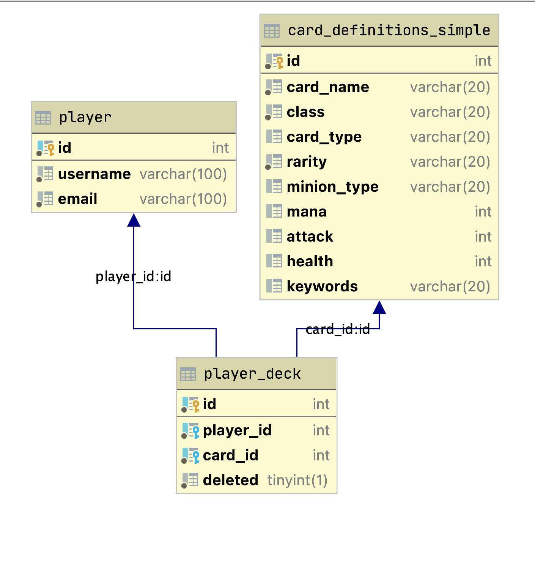
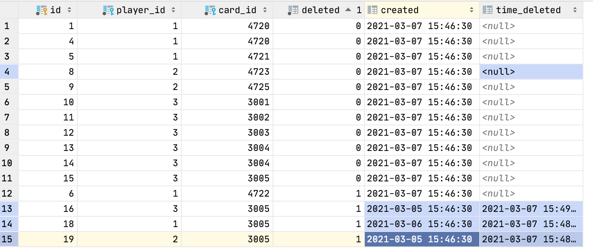

## Daniel St. John
- stjohnd777@gmail.com 
- 719 439 7835
---
- #### Some Remark 
    - The build system is cmake. 
    - The Unit Test frame ork is Catch2 a header only. 
    - The TimeMetric class is not part of the code base but provided to give timing stats, and this class came from my Utilities on GitHub. 
    - The reader should be able to use any IDE with CMake to run the unit test. There is a main method provided just in case cmake goes wrong.
---

#### Hearthstone Engineering Test
    - Send your solutions as source files attached in email.  
    
    - Use  C++ or C#
    - Any relational database can be used.
    - There is no set time limit, but know the approximate amount of time you spent on the test. 
    - You may use any reference materials (books, internet sites, etc.). 
    - We strongly recommend that you compile and test your answers. 
    - If you write any test code, please include it with your answers.
    - Write your answers assuming they will become part of a large codebase. 
    - Your code will be called frequently during gameplay and will be maintained and extended by the entire programming team.  

- ####  Coding Values: 
    -  Simple
    - Readable
    - Efficient
---
#####Looking at the assigment parts how to respond with email attachments requires some attention. 
- (files named question1.h, question1.cpp, test_question1.cpp in a zipfile question1.zip )
- (files named question12h, question2.cpp, test_question2.cpp in a zipfile question2.zip )
- (files named 3a.txt, 3b.txt, 3c1.txt, 3c2.a.txt and 3c2.b.txt a zipfile question3.zip )

- 1 Unique Digits  
- 2 Sort            
- 3 Database        
    - 3a. Create card definition tables.
    - 3b. Create player card collection tables with requirements:
        - Design table(s) to express all card instances owned by players (card collection).
        - A player can own multiple instances of same card.
        - Deleted cards should be are marked as deleted for tracking.
    - 3c. Write analytic queries for players’ card collections
        - 3c.1 Find out an average number of cards owned by each player
        - 3c.2 
            - 3c1.a Find out which card is being deleted the most by all players
            - 3c1.b Find an average time it takes for such card to be deleted by players

---

#### Question 1
- Write a function that takes an unsigned integer as input and returns true if all the digits in the base 10 representation of that number are unique. 

    - Example:
        - AllDigitsUnique(48778584) returns false
        - AllDigitsUnique(17308459) returns true
--- 
#### Answer 

   - I created two implementations. 
        - The solution under the namespace dsj::optimized is the intended solution. 
        - The solution under the namespace dsj::str is readable, simple and illustrates the issues with string when performance is needed.

- ##### Some remarks regarding the question 1
    - The largest base ten integer that has unique digits is 9,876,543,210.
    - I pondered the potential for summing the digits as a solution on the equivalence classes under rearrangement but this did not pan out 
    - Solving this problem by treating the integer as a string is easy but not performant
    - Striping digits via divide 10 mod 10 and tracking visited digits is the submitted approach
    - For illustration we contrasted the two natural approaches. 
    - ##### The optimized approach is at least one order of magnitude faster
        - Total Uniques:  6454891:   Run time : 1022.5
        - Total Uniques:  6454891:   Run Time : 11091.7
        
    - I decided to work with std:string over char*
    - Comments are stripped for space in Readme, see the git repo for commented code
```
namespace dsj {
    namespace optimized {
        unsigned int GetDigitAt(unsigned long integer, int n);
        unsigned int DigitLength(unsigned long integer);
        bool AllDigitsUnique(unsigned long candidate);
    }
    namespace str {
        unsigned int GetDigitAt(unsigned long integer, int n);
        unsigned int DigitLength(unsigned long integer);
        bool AllDigitsUnique(unsigned long candidate);
    }
}
```
```
namespace dsj {

    const unsigned long MAX_BASE10_UNIQUE_NUM = 9876543210;

    namespace optimized {
        static unsigned long tens[] = {1, 10, 100, 1000, 10000, 100000, 1000000, 10000000, 100000000, 1000000000,10000000000};
        inline unsigned int GetDigitAt(unsigned long integer, int n) {
            integer = integer / tens[n];
            if (integer == 0) return 0;
            auto digit = (integer % 10);
            return digit;
        }
        inline unsigned int DigitLength(unsigned long integer) {
            int len = 1;
            integer = integer / 10;
            while (integer > 0) {
                len++;
                integer = integer / 10;
            }
            return len;
        }
        bool AllDigitsUnique(unsigned long candidate) {
            bool isUniqueSequence = true;
            if (candidate <= MAX_BASE10_UNIQUE_NUM) {
                auto digitLen = DigitLength(candidate);
                std::array<bool, 10> registry;
                registry.fill(false);
                for (int index = 0; index < digitLen; index++) {
                    auto digit = GetDigitAt(candidate,index);
                    if (registry[digit] == false) {
                        registry[digit] = true;
                    } else {
                        isUniqueSequence = false;
                        break;
                    }
                }
            } else {
                isUniqueSequence = false;
            }
            return isUniqueSequence;
        }
    }

    namespace str {
        unsigned int DigitLength(unsigned long integer) {
            auto s = std::to_string(integer);
            return s.length();
        }
        unsigned int GetDigitAt(unsigned long integer, int n) {
            auto s = std::to_string(integer);
            reverse(s.begin(), s.end());
            return (s[n] - 48);
        }
        bool AllDigitsUnique(unsigned long candidate) {
            if (candidate > MAX_BASE10_UNIQUE_NUM) return false;
            auto s = std::to_string(candidate);
            std::set<char> s2(s.begin(), s.end());
            return s.length() == s2.size();
        }
    }
}
```
#####  All Test case not in Readme due to space see git repo please.
```
TEST_CASE("IsUniqueDigits  DivMod ", "[021]") {
    using namespace dsj::optimized;
    REQUIRE(AllDigitsUnique(9876543210) == true);
    REQUIRE(AllDigitsUnique(0) == true);
    REQUIRE(AllDigitsUnique(11) == false);
    REQUIRE(AllDigitsUnique(12) == true);
    REQUIRE(AllDigitsUnique(21) == true);
    REQUIRE(AllDigitsUnique(123) == true);
    REQUIRE(AllDigitsUnique(132) == true);
    REQUIRE(AllDigitsUnique(321) == true);
    REQUIRE(AllDigitsUnique(113) == false);
    REQUIRE(AllDigitsUnique(223) == false);
    REQUIRE(true == true);
}
```

--- 
#### Question 2  
- Write a function that modifies an input string, sorting the letters according to a sort order defined by a second string. 
- You may assume that every character in the input string also appears somewhere in the sort order string. 
- Make your function as fast as possible for long input strings.

- #### Example:
  - SortLetters(inputStr, “ isetlgornh”)
  - would modify the input string to “     iiisssseeettttttlgorrrnnhh”.
--- 
#### Answer

- #### Some general remarks on the problem:
    - The string is small enough ot place into memory so no distributed code. 
    - Unless I am missing something this question is a STL solution.
    - STL does in place sort and reportedly most efficient so data copying.
    - Perhaps the key point is passing string by reference so data copying.
    - using const for the sortOrder string
  
```
#include <string>
#include <algorithm>

namespace dsj {
    /**
     * SortLetters re arrange string characters into sorted order specificed by
     * the sortOrder string
     *
     * @param input ref <std::string>
     * @param sortOrder ref  <std::sting>
     */
    void SortLetters(std::string &input, const std::string &sortOrder) {
        std:
        sort(begin(input), end(input), [&](char a, char b) {
            int indexA = sortOrder.find(a, 0);
            int indexB = sortOrder.find(b, 0);
            return indexA < indexB;
        });
    }

}
```
---
#####  All Test case not in Readme due to space see git repo please.
```
using namespace std;
using namespace dsj;

TEST_CASE("Test 1 SortBy(` isetlgornh`)", "[001]") {
    string inputStr =  "sort the letters in this string";
    string sortBy = " isetlgornh";
    SortLetters(inputStr, sortBy);
    cout << inputStr << endl;
    REQUIRE(inputStr == "     iiisssseeettttttlgorrrnnhh");
}
```
---

#### Question 3 Database Design.

##### 3a. Create card definition tables.
-	Refer to all “Hearthstone’s Standard” cards list below
- https://playhearthstone.com/en-us/cards?set=standard&viewMode=table to design relational database table(s). 
- You only need to consider card attributes shown from the card list.
    - Class
    - Mana
    - Attack
    - Health
    - Card Type
    - Rarity
    - Minion Type
    - Keywords
---
#### Answer is to Create a card_definition Table
    - Remark
        - In real setting I would have a reference table for the class, type, rarity, minion type, and keywords. 
        - In fact I did initially but back off on this to keep queries simple

```
create table ref_card_type
(
    id   int auto_increment,
    word varchar(100) not null,
    constraint card_type_id_uindex
        unique (id),
    constraint card_type_word_uindex
        unique (word)
);

alter table ref_card_type
    add primary key (id);

create table card_definitions
(
	id int auto_increment primary key,
	name varchar(20) not null,
	mana int default 0 not null,
	attack int null,
	health int default 1 null,
	class int null,
	card_type int not null,
	rarity int null,
	minion_type int null,
	keywords varchar(100) null,
	constraint card_definitions_ref_minion_type_id_fk foreign key (minion_type) references ref_minion_type (id),
	constraint card_definitions_ref_rarity_id_fk foreign key (rarity) references ref_rarity (id)
);

create table card_definitions_simple
(
	id int auto_increment
		primary key,
	card_name varchar(20) not null,
	class varchar(20) not null,
	card_type varchar(20) null,
	rarity varchar(20) not null,
	minion_type varchar(20) null,
	mana int null,
	attack int null,
	health int null,
	keywords varchar(20) null
);

// and more ref table
```

#### below is ref_card_type 

| id | card_type |
| --- | ----------- |
1|HERO
25|Minion
28|Minion - Beast
24|Minion - Demon

#### below is simplified card_definition table 

| id | card_name | class | card_type | rarity | minion_type | mana | attack | haelth |
| --- | --- | --- | --- | --- | --- | --- | --- | --- |
3001|Big Bad Wolf|Neutral|Hero|Common||||20|
3002|Big Bad Wolf|Neutral|Hero|Common||||20|
3003|Kindly Grandmother|Neutral|Hero|Common||||20|
3004|The Crone|Neutral|Hero|Common||||30|
3005|Trembling|Neutral|Hero Power|Common|0|0|||

---
##### 3b. Create player card collection tables.
-	Design table(s) to express all card instances owned by players (card collection).
-	A player can own multiple instances of same card.
-	Deleted cards should be are marked as deleted for tracking.
---
#### Answer 
- Create player table for players 
- Create player_deck table correlating card to player with delete column
- The player_deck is manages the player deck. 
- Cards in the deck that have been deleted use the delete column as true
- The player can have many instances of the same card definition

#### See the ERD


##### To select the active cards in the deck for user with id
```
select deck.player_id, def.card_name
    from blizzard.player_deck as deck, blizzard.card_definitions_simple as def
        where deck.player_id = 1
            and deck.deleted = 0
            and def.id= deck.card_id;
```
##### To select the deleted cards in the deck for user with id
```
select deck.player_id, def.card_name
    from blizzard.player_deck as deck, blizzard.card_definitions_simple as def
        where deck.player_id = 1
            and deck.deleted = 1
            and def.id= deck.card_id;
```
---
##### 3c. Write analytic queries for players’ card collections.
-	###### 3c.1 Find out an average number of cards owned by each player.

###### Answer 3c.1 Average Players Deck Size
```
select avg(dt.active_cards) as average_deck_size from
   (
       select deck.player_id, count(deck.player_id) as active_cards
       from blizzard.player_deck as deck,
            blizzard.card_definitions_simple as def
       where deck.deleted = 0
         and def.id = deck.card_id
         and deck.player_id in (select player_id as p from player_deck)
       group by deck.player_id
   ) as dt
```
| average_deck_size  |
| --- |  
 4.0000|
--- 
##### Extra: an aside interesting query is listing the Players Active Deck size related to the above
```
select deck.player_id, count(deck.player_id) as active_cards
   from blizzard.player_deck as deck,
        blizzard.card_definitions_simple as def
   where deck.deleted = 0
     and def.id = deck.card_id
     and deck.player_id  in (select player_id as p from player_deck)
     group by deck.player_id;
```  
| PLAYER_ID | ACTIVE_CARDS |
| --- | ----------- |
 1|3
 2|2
 3|7
 ---
-	###### 3c.2  Find out which card is being deleted the most by all players and find an average time it takes for such card to be deleted by players. 

###### Answer 3c.2 

```
   select deck.card_id, count(deck.card_id) as deleted_card_count
   from player_deck as deck
   where deck.deleted = 1
   GROUP by deck.card_id
   order by deleted_card_count DESC  LIMIT 1;
```
The above return the card id and the number of deletes

| card_id | number_deletes|
| --- | ----------- |
3005|3

Then getting the max value
```
select  max(del.deleted_card_count) as m from (
          select deck.card_id, count(deck.card_id) as deleted_card_count
          from player_deck as deck
          where deck.deleted = 1
          GROUP by deck.card_id
                  ) as del
```
|   number_deletes|
|   ----------- |
3|
And the Card Id

For the average delete time I need to add create time and delete time
  

Knowing the card id above
```
select  avg(time_deleted-created) from player_deck where card_id = 3005
```
 |  avg(time_deleted-created)|
 |   ----------- |
 1666908.0000|
 

 
 

          
          